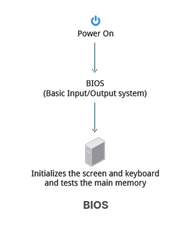
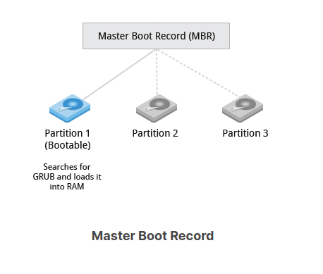
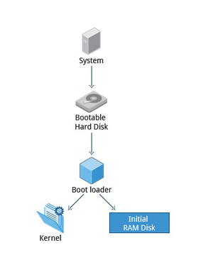
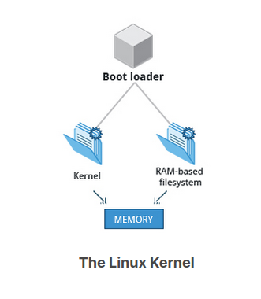
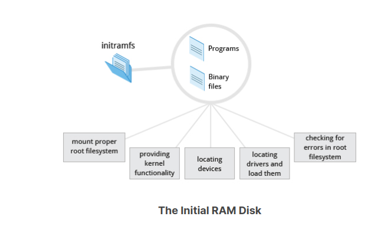
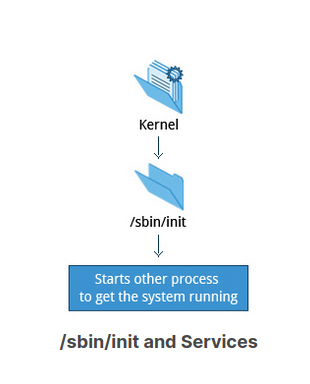

Boot Process
============

the boot process in a nutshell would look something like :

1. post/Bios
2. mbr
3. bootloader
4. kernel
5. init

#### POST/BIOS

POST : power on self test
BIOS : basic input/output system

when the computer is turned on BIOS will initialize the hardware, including the screen, keyboard and mouse and tests the **main memory**.
BIOS will get system information from CMOS. CMOS is a term usually used to describe the small amount of memory on a computer motherboard
that stores the BIOS settings. some of it includes the system time and date, as well as hardware settings.
CMOS is sometimes referred to as real-time clock (RTC) COS-MOS -> stands for complementary symmetry metal-oxide-semiconductor.
clearing CMOS means to reset the BIOS settings to their default levels. its a great troubleshooting step and its super easy.
BIOS AND CMOS:
BIOS is a computer chip on the motherboard like CMOS except that its purpose is to communicate between the processor and other hardware components like hard drive.
a computer without a BIOS wouldn't understand how these pieces of the computer work together.
the BIOS firmware is also what performs the power on self test to test those pieces of hardware and what ultimately runs the bootloader to launch the operating system.
when the computer first boots up, BIOS pulls information from CMOS chip to understand the hardware setting, time and any other piece of information.
**Note that ** : CMOS batteries will last the lifetime of a motherboard up to 10 years.

#### MASTER BOOT RECORD (MBR)

Up to this point the system will not access any mass storage media.so all it has is the information it got from CMOS.once the POST is completed the system control passes from the BIOS to the boot loader,
which is usually stored on one of the hard disks in the system, either in the boot sector (for traditional BIOS/MBR system) or the EFI partition (for more recent (Unified) Extensible Firmware Interface or EFI/UEFI systems).

The most common boot loaders are GRUB(GRand Unified Boot loader) ISOLINUX(for booting from removeable media) and DAS U-BOOT (for booting on emvedded devices/appliances). Most linux boot loaders can present a user interface for choosing alternative options for booting linux, even other operating system that might be installed. when booting linux, the boot loader is responseable for loading the kernel image and the initual RAM disk or filesystem (which contains some critical files and device drivers needed to start the system) into memory.

#### BOOTLOADER

###### for BIOS/MBR method :

For systems using the BIOS/MBR method, the boot loader resides at the first sector of the hard disk, also known as the Master Boot Record (MBR). The size of the MBR is just 512 bytes. In this stage, the boot loader examines the partition table and finds a bootable partition. Once it finds a bootable partition, it then searches for the second stage boot loader, for example GRUB, and loads it into RAM (Random Access Memory).

###### for EFI/UEFI method :

For systems using the EFI/UEFI method, UEFI firmware reads its Boot Manager data to determine which UEFI application is to be launched and from where (i.e. from which disk and partition the EFI partition can be found). The firmware then launches the UEFI application, for example GRUB, as defined in the boot entry in the firmware's boot manager. This procedure is more complicated, but more versatile than the older MBR methods.

The second stage boot loader resides under /boot. A splash screen is displayed, which allows us to choose which operating system (OS) to boot. After choosing the OS, the boot loader loads the kernel of the selected operating system into RAM and passes control to it. Kernels are almost always compressed, so its first job is to uncompress itself. After this, it will check and analyze the system hardware and initialize any hardware device drivers built into the kernel.

#### KERNEL

The boot loader loads both the kernel and the initual RAM-based file system (initramfs) into memory, so it can be used directly by the kernel.

When the kernel is loaded in RAM, it immediately initializes and configures the computer’s memory and also configures all the hardware attached to the system. This includes all processors, I/O subsystems, storage devices, etc. The kernel also loads some necessary user space applications.

#### INIT

The initramfs filesystem image contains programs and binary files that perform all actions needed to mount the proper root filesystem, like providing kernel functionality for the needed filesystem and device drivers for mass storage controllers with a facility called udev (for user device), which is responsible for figuring out which devices are present, locating the device drivers they need to operate properly, and loading them. After the root filesystem has been found, it is checked for errors and mounted.

The mount program instructs the operating system that a filesystem is ready for use, and associates it with a particular point in the overall hierarchy of the filesystem (the mount point). If this is successful, the initramfs is cleared from RAM and the init program on the root filesystem (/sbin/init) is executed.

init handles the mounting and pivoting over to the final real root filesystem. If special hardware drivers are needed before the mass storage can be accessed, they must be in the initramfs image.

--------------------------------

#####/sbin/init and Services

Once the kernel has set up all its hardware and mounted the root filesystem, the kernel runs /sbin/init. This then becomes the initial process, which then starts other processes to get the system running. Most other processes on the system trace their origin ultimately to init; exceptions include the so-called kernel processes. These are started by the kernel directly, and their job is to manage internal operating system details.

Besides starting the system, init is responsible for keeping the system running and for shutting it down cleanly. One of its responsibilities is to act when necessary as a manager for all non-kernel processes; it cleans up after them upon completion, and restarts user login services as needed when users log in and out, and does the same for other background system services.

Traditionally, this process startup was done using conventions that date back to the 1980s and the System V variety of UNIX. This serial process had the system passing through a sequence of runlevels containing collections of scripts that start and stop services. Each runlevel supported a different mode of running the system. Within each runlevel, individual services could be set to run, or to be shut down if running.

However, all major distributions have moved away from this sequential runlevel method of system initialization, although they usually emulate many System V utilities for compatibility purposes. Next, we discuss the new methods, of which systemd has become dominant.

#### Startup Alternatives

SysVinit viewed things as a serial process, divided into a series of sequential stages. each stage required completion before the next could proceed.thus startup did not easily take advantage of the parallel processing that could be done on multiple processors or cores.

Furthermore, shutdown and reboot was seen as a relatively rare event; exactly how longi it took was not considered important. this is no longer true, especially with mobile devices and embedded linux systems.

Some modern methods, such as the use of containers, can require almost instantaneous startup times. Thus, systems now require methods with faster and enhanced capabilities. Finally, the older methods required rather complicated startup scripts, which were difficult to keep universal across distribution versions, kernel versions, architectures, and types of systems. The two main alternatives developed were:
**Upstart**

            - Developed by Ubuntu and first included in 2006
            - Adopted in Fedora 9 (in 2008) and in RHEL 6 and its clones

**systemd**

            - Adopted by Fedora first (in 2011)
            - Adopted by RHEL 7 and SUSE
            - Replaced Upstart in Ubuntu 16.04

#### Systemd Features

Systems with systemd start up faster than those with earlier init methods. This is largely because it replaces a serialized set of steps with aggressive parallelization techniques, which permits multiple services to be initiated simultaneously.

Complicated startup shell scripts are replaced with simpler configuration files, which enumerate what has to be done before a service is started, how to execute service startup, and what conditions the service should indicate have been accomplished when startup is finished. One thing to note is that /sbin/init now just points to /lib/systemd/systemd; i.e. systemd takes over the init process.

One systemd command (systemctl) is used for most basic tasks. While we have not yet talked about working at the command line, here is a brief listing of its use:

            Starting, stopping, restarting a service (using httpd, the Apache web server, as an example) on a currently running system:
            $ sudo systemctl start|stop|restart httpd.service
            Enabling or disabling a system service from starting up at system boot:
            $ sudo systemctl enable|disable httpd.service

